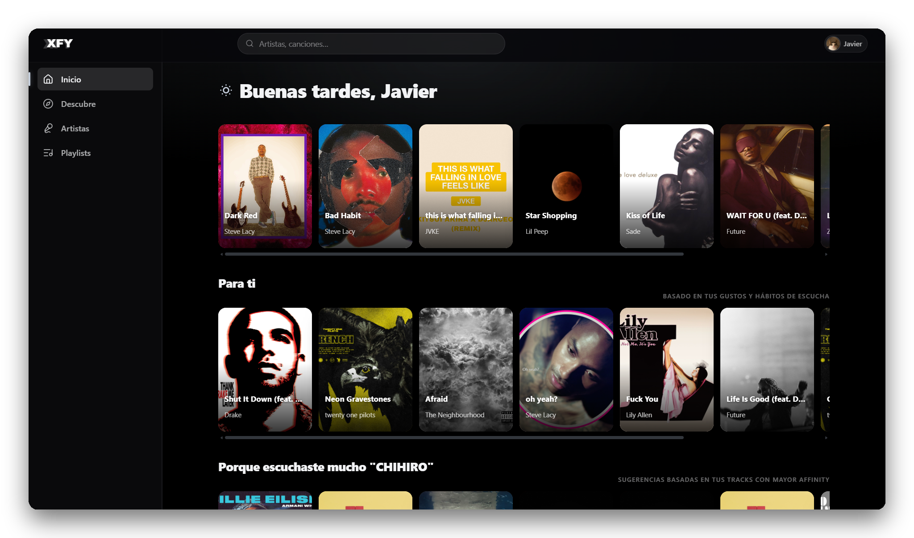
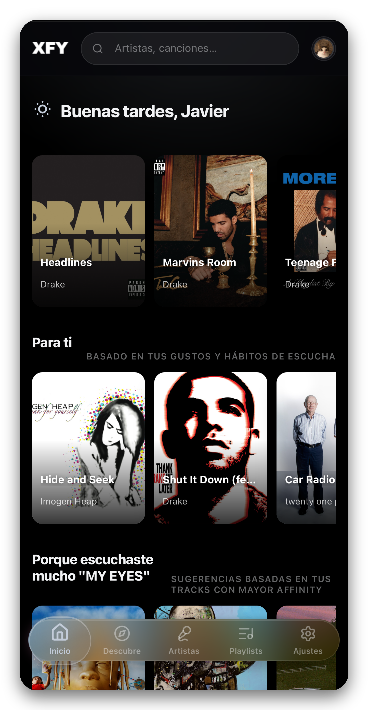

<div align="center">

# XFY

**Reproductor de música con letras karaoke, cuentas reales, sync entre
dispositivos y catálogo de YouTube Music.**

Construido con React 19 + Vite + TypeScript estricto, corriendo 100%
sobre Vercel (frontend + Serverless Functions).

</div>

<!--
  📸 CAPTURAS — reemplazá estos paths por tus propias imágenes:
    docs/screenshots/desktop.png  → vista de escritorio
    docs/screenshots/mobile.png   → vista mobile / PWA instalada
  Podés armar el collage que quieras; esto es solo un punto de partida
  con las dos imágenes lado a lado.
-->

<p align="center">
  
</p>
<p align="center">
  
</p>

## Qué es XFY

XFY es un reproductor de música que busca y reproduce desde el catálogo
de YouTube Music, con letras sincronizadas palabra a palabra estilo
karaoke, cuentas de usuario reales (con passkeys y 2FA), sincronización
tipo "Spotify Connect" entre tus dispositivos, y funciones sociales como
Wrapped y Blend. Es una PWA instalable, pensada para sonar tan bien en
el celular como en la compu.

## Características

- 🔎 **Catálogo y búsqueda** completos de YouTube Music, con portadas,
  biografías de artista y discografías enriquecidas desde iTunes,
  TheAudioDB, MusicBrainz, Deezer y Wikipedia.
- 🎤 **Letras karaoke palabra a palabra** (LRCLIB + Enhanced LRC), con
  fallback a las letras nativas de YouTube Music.
- 👤 **Cuentas reales**: registro con email/contraseña, **passkeys
  (WebAuthn)** y **2FA por TOTP** con códigos de respaldo, además de
  login con **Spotify** (Authorization Code + PKCE) para importar tus
  playlists y Me Gusta.
- 📱 **Sync entre dispositivos** al estilo "Spotify Connect": transferí
  la reproducción de tu compu al celular (y viceversa) en tiempo real
  vía Ably, con long-poll como respaldo si el realtime no está
  disponible.
- 🎧 **Reproducción sin cortes**: arranque instantáneo por IFrame de
  YouTube y, en paralelo, extracción y cacheo del audio en un store
  propio de 3 niveles (Cloudflare R2 → Vercel Blob → Backblaze B2) para
  que la próxima escucha sea directa, sin depender de YouTube.
- 🗣️ **AI DJ**: comentarios cortos entre canciones basados en tus
  hábitos de escucha, leídos con la Web Speech API del navegador — sin
  claves ni backend extra.
- 📊 **Wrapped y Blend**: tu resumen de escucha (estilo "Spotify
  Wrapped") y comparación de gustos con otro usuario vía un código para
  compartir.
- 🔔 **Notificaciones de lanzamientos**: avisa cuando tus artistas más
  escuchados sacan algo nuevo, incluso con la app cerrada (Web Push).
- 📲 **PWA completa**: instalable, Share Target, File Handling, Badging
  API, Wake Lock en modo cinema/karaoke y Periodic Background Sync.

## Stack

- **Vite + React 19 + TypeScript strict** (`noUncheckedIndexedAccess`,
  `verbatimModuleSyntax`) — todo el proyecto, frontend y funciones,
  100% TypeScript.
- **Zustand** — estado global (sesión, reproductor, portadas, dispositivos).
- **Motion** (`motion/react`) — animaciones de UI.
- **Base UI** (`@base-ui/react`) — componentes accesibles sin estilos que pelear.
- **React Router 7** (`HashRouter`) · **Sonner** (notificaciones) ·
  **Lucide / Morphicons / AnimateIcons** (iconografía).
- **hls.js** — streams HLS (Audius / Motion Art / audio remuxeado).
- **Neon (Postgres)** — cuentas, sesiones, playlists, dispositivos.
- **Ably** — transporte realtime para el sync entre dispositivos.
- **Cloudflare R2 / Vercel Blob / Backblaze B2** — caché de audio en 3 niveles.
- **@simplewebauthn** — passkeys. **web-push** — notificaciones push (VAPID).
- **oxlint** (linting) · **Vitest + Testing Library** (tests).

## Arquitectura, en corto

- **Catálogo y búsqueda**: `ytmusic-api` corriendo dentro de una función
  serverless (`api/ytmusic.ts`). En desarrollo, un plugin de
  `vite.config.ts` ejecuta esa misma función dentro del server de Vite.
- **Reproducción**: al pedir una canción, el frontend primero chequea si
  ya está cacheada (R2 → Blob → B2, en ese orden). Si no, arranca al
  instante por el IFrame de YouTube (latencia cero) y dispara en
  paralelo la extracción del audio (`youtubei.js` + PO tokens BotGuard)
  para subirlo al store en background. Las pistas externas (Audius) usan
  hls.js.
- **Cuentas y seguridad**: Postgres (Neon) con contraseñas PBKDF2,
  passkeys vía WebAuthn y 2FA por TOTP con códigos de respaldo
  hasheados. Sesiones y rate limiting en la misma base.
- **Sync entre dispositivos**: cada dispositivo se conecta directo a
  Ably (WebSocket) para recibir comandos en milisegundos; un long-poll
  contra la base (hasta 25s por request) hace de respaldo permanente —
  incluida la sincronización de nickname/avatar/tema entre
  dispositivos, que Ably no cubre.
- **Letras**: LRCLIB con fallback a YouTube Music. Tolerante a ruido en
  títulos ("(Official Video)", "feat. X"…) y descarta candidatos con
  duración incompatible. El timing palabra-a-palabra sale del Enhanced
  LRC cuando existe; si no, se estima con un distribuidor silábico.
- **Nuevos lanzamientos**: cada 6h el cliente revisa iTunes por tus
  artistas más escuchados; un cron diario en Vercel manda Web Push
  aunque la app esté cerrada.

## Estructura del proyecto

```
api/                      Funciones serverless de Vercel (TypeScript)
  ytmusic.ts                Búsqueda/catálogo/letras (ytmusic-api)
  ytcache.ts / ytaudio.ts   Extracción y cacheo de audio de YouTube
  ytstream.ts / ytaudit.ts  Streaming HLS / auditoría + eviction LRU
  spotify.ts                Login de Spotify (Authorization Code + PKCE)
  push.ts                   Suscripción y estado de Web Push
  push/cron-release-watch.ts  Cron diario: push de lanzamientos nuevos
  motionart.ts               Portadas animadas estilo Apple Music
  proxyutils.ts               Proxies de imágenes/APIs externas (CORS)
  cron/r2-lifecycle.ts        Degrada audio viejo: R2 → B2 cada 6h
  _lib/
    accountAuth.ts / accountDb.ts / accountResources.ts   Cuentas
    webauthn.ts / totp.ts        Passkeys y 2FA
    realtime.ts                  Tokens y publish de Ably
    tieredAudioStore.ts / r2Ledger.ts / s3Compat.ts   Store de audio en 3 niveles
    ytcore.ts / ytstore.ts       Núcleo de extracción y caché de YouTube
    remux.ts / tagAudio.ts       Reempaquetado y metadata del audio
    rateLimit.ts / ssrfGuard.ts  Protecciones de las funciones
public/                    Assets estáticos e íconos PWA
src/
  main.tsx / App.tsx         Arranque, rutas y engines globales
  sw.ts                      Service worker (injectManifest, push/sync)
  features/                  Un dominio por carpeta (components/, store/, lib/)
    auth/                      Cuentas: login, passkeys, 2FA, migración legacy
    catalog/                   Home, Discover, búsqueda, recomendaciones
    player/                    Engines de reproducción, cola, AI DJ, MediaSession
    lyrics/                    Motor de letras karaoke palabra a palabra
    artists/                   Páginas de artista y álbum, discografías
    playlists/                 Playlists + importación desde YT Music/Spotify
    devices/                   Sync tipo "Spotify Connect" (Ably + long-poll)
    wrapped/                   Wrapped (resumen anual/mensual) y Blend
    settings/                  Temas, almacenamiento y caché
  services/api/               Un cliente por fuente externa
  shared/                     UI transversal, IndexedDB, caché, hooks
  styles/                     Estilos globales
```

Aliases de imports (`vite.config.ts`): `@` → `src/`, `@features`,
`@shared`, `@services`.

## Desarrollo local

```bash
npm install
npm run dev        # plugin interno replica la API de YT Music
npm run test        # vitest
npm run lint         # oxlint
npm run typecheck    # tsc (app + funciones), doble pasada
npm run build        # build de producción → dist/
```

## Desplegar en producción

Pensado para **Vercel** (Framework Preset: Vite · Build: `npm run build`
· Output: `dist`).

### Variables de entorno

| Variable | Para qué |
|---|---|
| `DATABASE_URL` | Postgres (Neon) — cuentas, sesiones, playlists, dispositivos |
| `WEBAUTHN_RP_ID` / `WEBAUTHN_ORIGIN` | Passkeys (dominio y origen esperado) |
| `BLOB_READ_WRITE_TOKEN` o conexión OIDC | Caché de audio nivel legacy (Vercel Blob) |
| `R2_ACCOUNT_ID` / `R2_ACCESS_KEY_ID` / `R2_SECRET_ACCESS_KEY` / `R2_BUCKET` / `R2_PUBLIC_BASE_URL` | Caché de audio nivel HOT (Cloudflare R2) |
| `B2_KEY_ID` / `B2_APPLICATION_KEY` / `B2_ENDPOINT` / `B2_BUCKET` / `B2_PUBLIC_BASE_URL` | Caché de audio nivel COLD (Backblaze B2) |
| `VITE_R2_BASE_URL` / `VITE_BLOB_BASE_URL` / `VITE_B2_BASE_URL` | Bases públicas de lectura para el frontend (una por nivel) |
| `SPOTIFY_CLIENT_ID` / `SPOTIFY_CLIENT_SECRET` / `VITE_SPOTIFY_CLIENT_ID` | Login real de Spotify |
| `ABLY_API_KEY` | Sync realtime entre dispositivos (opcional, cae a long-poll sin ella) |
| `VAPID_PUBLIC_KEY` / `VAPID_PRIVATE_KEY` / `VITE_VAPID_PUBLIC_KEY` | Web Push (generar con `npx web-push generate-vapid-keys`) |
| `ADMIN_TOKEN` | Autoriza la auditoría manual del caché de audio |
| `CRON_SECRET` | Protege el disparo manual de los crons |

Todas las variables de audio (R2/Blob/B2) son opcionales de forma
independiente: sin ninguna configurada, cada reproducción vuelve a
arrancar por el IFrame de YouTube en vez de servir desde caché — la app
sigue funcionando igual, solo sin ese acelerador.

<details>
<summary>Opcionales de scraping de YouTube (solo si empieza a bloquear)</summary>

- `YTMUSIC_COOKIE` / `YTDL_COOKIE` — cookies de una sesión real de
  YouTube, para cuando Vercel empieza a recibir bloqueos consistentes.
- `YT_AUDIO_CLIENT` — cliente Innertube a usar (default `YTMUSIC`).
- `YT_PROXY_URL` — proxy residencial/móvil contra el bloqueo por
  reputación de IP de datacenter.
- `YT_DISABLE_EXTERNAL_FALLBACK` — desactiva el fallback a fuentes
  externas si YouTube falla.

</details>

## Contribuir

Las contribuciones son bienvenidas — abrí un issue para discutir el
cambio antes de un PR grande, y corré `npm run lint` y
`npm run typecheck` antes de mandarlo.

## Licencia

Este proyecto está bajo la **GNU Affero General Public License v3.0
(AGPL-3.0)**. En corto: podés usar, modificar y aportar cambios
libremente, pero si corrés una versión modificada como servicio público,
tenés que compartir el código de esa versión con tus usuarios. Ver el
archivo [`LICENSE`](./LICENSE) para el texto completo.
